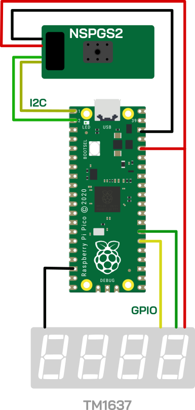

# IoThings-Raspberry-Demo

The demo for IoThings trade fair has the setup showed below.
The Raspberry Pi Pico H is used to measure the pressure from a Novosense evk based on [NSPGS2](https://www.novosns.com/en/mems-pressure-sensor-1641) and to display it to a 7 segment module `SSE3642WWG` by Tricomtek which used the `TM1637` driver. 
The `NSPGS2`communicates via I2C, while the `TM1637` has a custom protocol similar to I2C which uses two pins, a bidirectional data pin (`DIO`) and a clock pin (`CLK`). The example is developed via Micropython. 

The connections are as follows.

|Raspberry Pico|SSE3642WWG|NSPGS2|
|---|---|---|
|GP0 ||SDA|
|GP1 ||SCL|
|GP20|DIO||
|GP21|CLK||

## Setup

## How to use this example

Download and install [Thonny IDE](https://thonny.org/) and follow the [instructions](https://projects.raspberrypi.org/en/projects/getting-started-with-the-pico/0) to download micro python to the raspberry pi.

Clone this repo with the recursive flag `git clone --recursive https://github.com/Ineltek-IT/IoThings-Raspberry-Demo.git`

Download in the Raspberry Pi Pico the files you find in this repo, namely `main.py`, `NSPGS2.py` and the `TM1637` library located in `libs/MIcropython/libs/tm1637.py`. 

## Acknowledgement

Thanks to Benjamin Janzen for providing the modified library for the `NSPGS2` and to shedboy71 for the `TM1637` library. 

